# Lebane Full Stack Challenge

Challenge técnico Full Stack desarrollado con **Java 21, Spring Boot 3, React y TypeScript**.

El proyecto implementa un panel de administración para una inmobiliaria, permitiendo listar, filtrar, crear, visualizar y editar departamentos.

La aplicación incluye:

- API REST con Spring Boot.
- Persistencia con PostgreSQL.
- Filtros dinámicos mediante JPA Specifications / Criteria API.
- Almacenamiento de imágenes compatible con S3 usando LocalStack.
- Generación automática de un conjunto de datos representativo.
- Panel de administración en React.
- Autocompletado de direcciones mediante Geoapify.
- Carga y validación de imágenes.
- UI responsiva.
- Manejo centralizado de errores en backend.
- Estados de carga y error en frontend.
- Tests unitarios e integración en backend.
- Tests unitarios e integración en frontend.
- Tests end-to-end con Playwright.
- Infraestructura local basada en Docker.
- Documentación de API con OpenAPI / Swagger.

---

# Índice

- [Arquitectura](#arquitectura)
- [Stack tecnológico](#stack-tecnológico)
- [Estructura del proyecto](#estructura-del-proyecto)
- [Arquitectura del backend](#arquitectura-del-backend)
- [Arquitectura del frontend](#arquitectura-del-frontend)
- [Base de datos](#base-de-datos)
- [Datos iniciales - Seed](#datos-iniciales---seed)
- [Almacenamiento de imágenes](#almacenamiento-de-imágenes)
- [Autocompletado de direcciones](#autocompletado-de-direcciones)
- [API](#api)
- [Filtros y paginación](#filtros-y-paginación)
- [Validaciones](#validaciones)
- [Manejo de errores](#manejo-de-errores)
- [Concurrencia](#concurrencia)
- [Funcionalidades del frontend](#funcionalidades-del-frontend)
- [Variables de entorno](#variables-de-entorno)
- [Cómo ejecutar el proyecto](#cómo-ejecutar-el-proyecto)
- [Testing](#testing)
- [Docker](#docker)
- [Decisiones de arquitectura](#decisiones-de-arquitectura)
- [Trade-offs](#trade-offs)
- [Posibles mejoras](#posibles-mejoras)

---

# Arquitectura

La aplicación está organizada como un **monorepo**, conteniendo backend, frontend e infraestructura local.

El backend sigue una arquitectura de **monolito modular organizado por feature**.

El frontend también utiliza una organización **feature-based**, manteniendo juntos los componentes, hooks, páginas, servicios y tipos relacionados con departamentos.

## Arquitectura completa del sistema

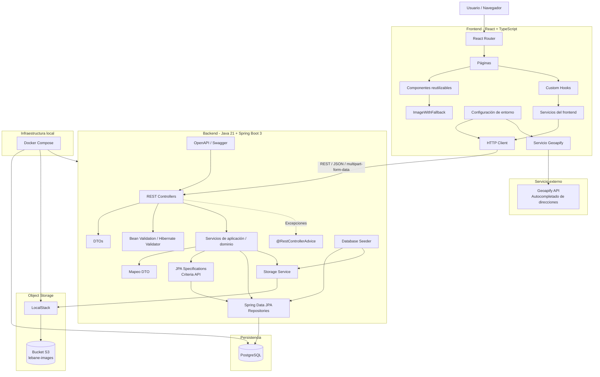

El flujo principal de una petición es:

```text
Navegador
   ↓
React
   ↓
Servicio del frontend
   ↓
HTTP client
   ↓
Spring REST Controller
   ↓
Servicio de aplicación
   ↓
Repositorio / Storage Service
   ↓
PostgreSQL + S3
```

---

# Flujo de una request en backend

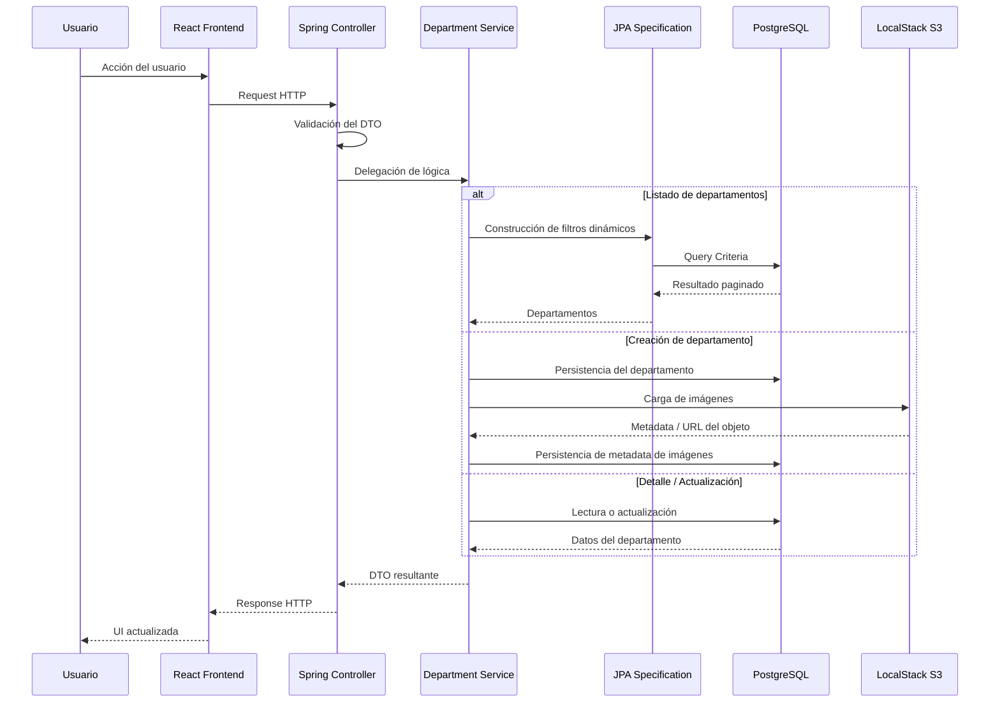

---

# Stack tecnológico

## Backend

- Java 21
- Spring Boot 3
- Spring Web
- Spring Data JPA
- Hibernate
- Hibernate Validator
- JPA Specifications
- Criteria API
- PostgreSQL
- Flyway
- AWS SDK / API compatible con S3
- LocalStack
- Springdoc OpenAPI / Swagger
- JUnit 5
- Mockito
- Testcontainers
- Maven
- Docker

## Frontend

- React
- TypeScript
- Vite
- React Router
- Tailwind CSS
- HTTP client basado en Fetch
- Geoapify
- Jest
- React Testing Library
- Testing Library User Event
- Playwright
- Oxlint

## Infraestructura

- Docker
- Docker Compose
- PostgreSQL
- LocalStack S3

---

# Estructura del proyecto

```text
lebane-challenge/
│
├── backend/
│   ├── src/
│   │   ├── main/
│   │   │   ├── java/
│   │   │   └── resources/
│   │   └── test/
│   ├── Dockerfile
│   ├── pom.xml
│   └── mvnw
│
├── frontend/
│   ├── e2e/
│   ├── src/
│   │   ├── api/
│   │   ├── components/
│   │   ├── config/
│   │   ├── features/
│   │   └── test/
│   ├── .env.example
│   ├── jest.config.cjs
│   ├── babel.config.cjs
│   ├── playwright.config.ts
│   ├── package.json
│   └── vite.config.ts
│
├── infra/
│
├── docker-compose.yml
├── .env.example
└── README.md
```

---

# Arquitectura del backend

El backend está organizado siguiendo un enfoque **package-by-feature**.

En lugar de agrupar todo únicamente por capas técnicas como:

```text
controller/
service/
repository/
```

se mantienen juntos los elementos relacionados a cada feature.

El dominio principal de la aplicación es `Department`.

La responsabilidad del backend se divide en:

```text
Department
│
├── Controller
│
├── Service
│
├── DTOs
│
├── Validation
│
├── Mapper
│
├── Entities
│
├── Repositories
│
├── Specifications
│
└── Exceptions
```

La infraestructura de soporte se mantiene separada:

```text
Storage
├── StorageService
└── S3StorageService

Configuration
├── Configuración S3
├── CORS
└── OpenAPI

Seed
└── DatabaseSeeder

Error Handling
└── RestControllerAdvice
```

Esta organización mantiene una buena cohesión entre funcionalidades y separa claramente HTTP, lógica de negocio, persistencia e infraestructura externa.

---

# Arquitectura del frontend

El frontend utiliza una estructura organizada por feature.

```text
src/
│
├── api/
│   └── httpClient.ts
│
├── components/
│   └── ImageWithFallback.tsx
│
├── config/
│   └── environment.ts
│
└── features/
    └── departments/
        │
        ├── components/
        │   ├── AddressAutocomplete.tsx
        │   ├── DepartmentCard.tsx
        │   ├── DepartmentFilters.tsx
        │   └── DepartmentTable.tsx
        │
        ├── hooks/
        │   ├── useDepartment.ts
        │   └── useDepartments.ts
        │
        ├── pages/
        │   ├── DepartmentsListPage.tsx
        │   ├── DepartmentCreatePage.tsx
        │   ├── DepartmentDetailPage.tsx
        │   └── DepartmentEditPage.tsx
        │
        ├── services/
        │   ├── departmentService.ts
        │   └── geoapifyService.ts
        │
        └── types/
            ├── department.ts
            └── geoapify.ts
```

## Flujo de datos del frontend

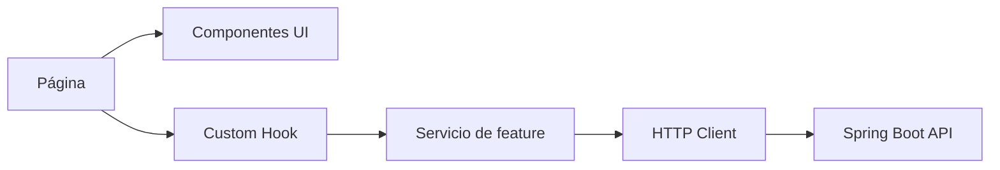

Los componentes de React no realizan llamadas HTTP crudas directamente.

La comunicación con la API está aislada en:

```text
api/
services/
```

Esto mejora mantenibilidad, separación de responsabilidades y testabilidad.

---

# Base de datos

La aplicación utiliza **PostgreSQL**.

Las relaciones principales son:

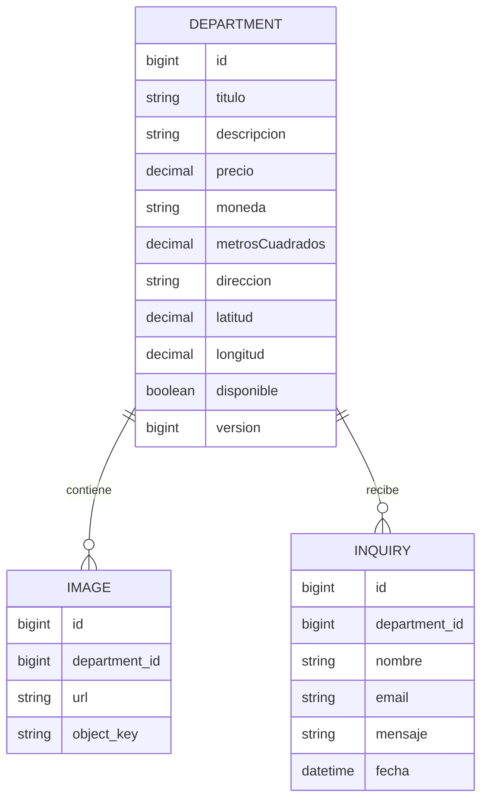

La base de datos guarda la **metadata de imágenes**, no los archivos binarios.

Los archivos se almacenan en S3-compatible storage.

---

# Migraciones de base de datos

La evolución del esquema se gestiona mediante **Flyway**.

Las migraciones se ejecutan durante el arranque del backend.

Esto permite que la inicialización de base de datos sea reproducible entre:

- desarrollo local
- tests automatizados
- Docker

---

# Datos iniciales - Seed

La aplicación genera automáticamente un conjunto representativo de datos de prueba.

El seed contiene más de:

```text
500 departamentos
```

Cada departamento incluye valores variados de:

- título
- descripción
- precio
- moneda
- metros cuadrados
- disponibilidad
- dirección
- coordenadas
- imágenes
- consultas

Cada departamento puede contener entre:

```text
0 - 8 imágenes
```

y:

```text
0 - 40 consultas
```

Esto permite probar correctamente:

- paginación
- filtros
- relaciones
- carga de imágenes
- pantallas de detalle
- volumen realista de datos

## Arquitectura del seed

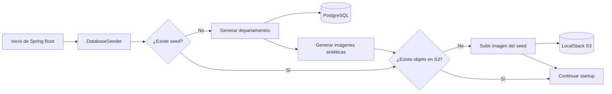

---

# Recuperación de imágenes del seed

PostgreSQL y LocalStack persisten de forma independiente.

Por esta razón puede ocurrir que:

```text
PostgreSQL conserve metadata
+
LocalStack haya perdido objetos
```

Para evitar inconsistencias en el entorno local, el backend verifica en cada startup si los objetos sintéticos del seed siguen existiendo.

La abstracción de almacenamiento expone una operación equivalente a:

```text
StorageService.exists(...)
```

La implementación S3 verifica la existencia del objeto.

Si falta una imagen del seed:

```text
Metadata presente en PostgreSQL
        +
Objeto ausente en S3
        ↓
El backend regenera la imagen sintética
```

Solo se regeneran imágenes generadas automáticamente por el seed.

Las imágenes reales subidas por usuarios no se recrean, ya que su contenido binario original no está disponible.

---

# Almacenamiento de imágenes

Las imágenes se guardan en un object storage compatible con **S3**.

En desarrollo local se utiliza:

```text
LocalStack
```

Bucket:

```text
lebane-images
```

## Flujo de carga de imágenes

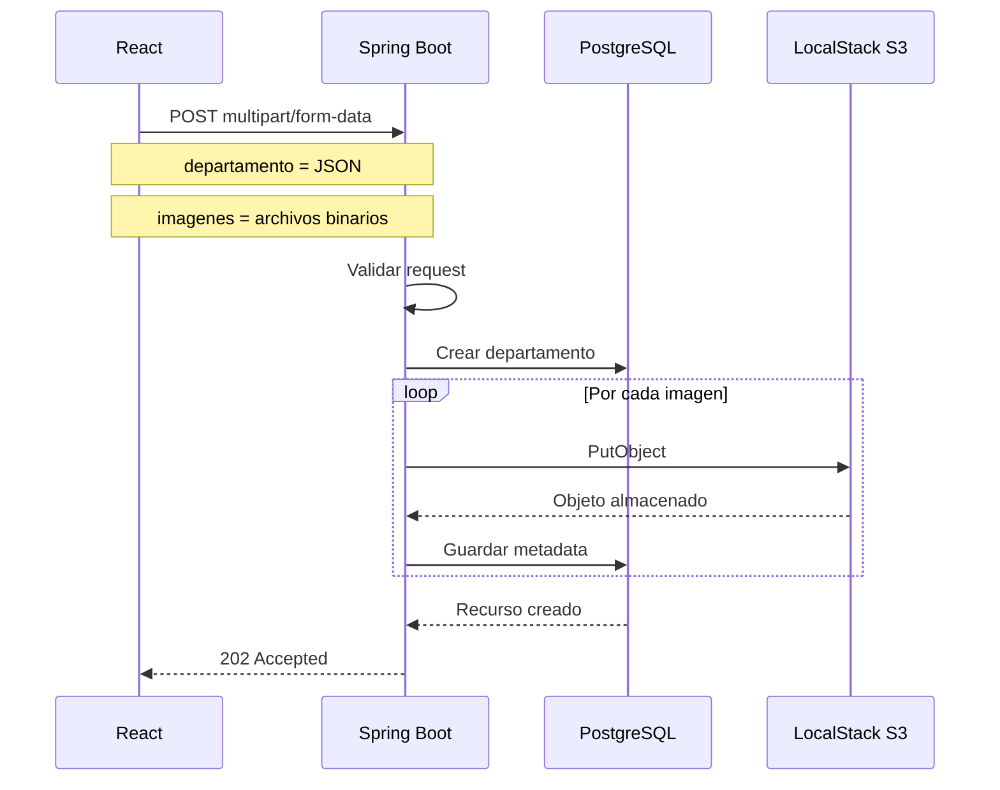

Las imágenes se cargan **server-side**.

El frontend envía los datos y archivos al backend mediante:

```text
multipart/form-data
```

Esta decisión evita exponer credenciales de storage al navegador y mantiene la validación y lógica de almacenamiento centralizada en backend.

---

# Manejo de imágenes rotas

El frontend es resiliente ante URLs inválidas o imágenes ausentes.

Se utiliza el componente:

```text
ImageWithFallback
```

Si una imagen no puede cargarse, se muestra un placeholder.

Este comportamiento se utiliza tanto en:

- listado / cards
- galería de detalle

---

# Autocompletado de direcciones

El proyecto utiliza **Geoapify** para autocompletar direcciones.

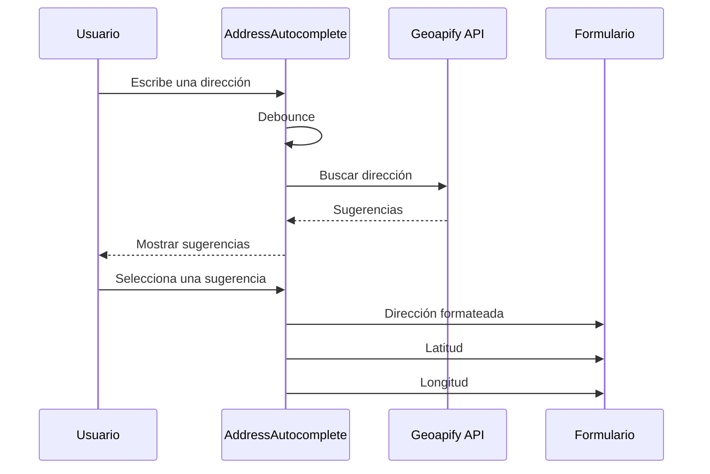

Al seleccionar una dirección se persiste:

- dirección formateada
- latitud
- longitud

Si el usuario modifica manualmente la dirección luego de seleccionar una sugerencia, las coordenadas anteriores se invalidan.

El formulario obliga a volver a seleccionar una sugerencia válida.

Esto evita inconsistencias como:

```text
Dirección A
+
Coordenadas de Dirección B
```

---

# API

URL base:

```text
http://localhost:8080
```

Prefijo:

```text
/api/departamentos
```

## Crear departamento

```http
POST /api/departamentos
```

Content-Type:

```text
multipart/form-data
```

Incluye:

```text
departamento
```

como JSON y:

```text
imagenes
```

como archivos.

Respuesta esperada:

```text
202 Accepted
```

---

## Listar departamentos

```http
GET /api/departamentos
```

Soporta paginación y filtros.

Ejemplo:

```http
GET /api/departamentos?pagina=0&cantidad=10&disponible=true
```

El listado incluye:

- ID
- título
- precio
- moneda
- metros cuadrados
- disponibilidad
- dirección
- imagen principal
- cantidad de imágenes
- cantidad de consultas

---

## Detalle de departamento

```http
GET /api/departamentos/{id}
```

Devuelve:

- información completa del departamento
- imágenes
- consultas

Respuestas posibles:

```text
200 OK
404 Not Found
```

---

## Actualizar departamento

```http
PUT /api/departamentos/{id}
```

Permite modificar la información del departamento.

Respuestas posibles:

```text
200 OK
400 Bad Request
404 Not Found
409 Conflict
```

---

# Swagger / OpenAPI

La API expone documentación mediante OpenAPI.

Swagger UI:

```text
http://localhost:8080/swagger-ui/index.html
```

Especificación OpenAPI:

```text
http://localhost:8080/v3/api-docs
```

Swagger permite inspeccionar y ejecutar manualmente los endpoints disponibles.

---

# Filtros y paginación

Los filtros de departamentos están implementados utilizando:

```text
Spring Data JPA Specifications
+
Criteria API
```

No se utilizan consultas JPQL o SQL dinámicas mediante strings.

## Flujo de filtros

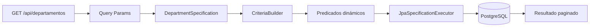

Los filtros pueden combinarse dinámicamente.

El frontend permite filtrar por:

- precio
- metros cuadrados
- disponibilidad

La paginación se realiza en backend.

---

# Validaciones

La validación se realiza en múltiples capas.

## Frontend

Se validan, entre otros:

- campos obligatorios
- precio mayor a cero
- metros cuadrados mayores a cero
- dirección seleccionada desde autocomplete
- coordenadas válidas
- formato de imágenes
- cantidad máxima de imágenes
- tamaño máximo por imagen

## Backend

El backend también valida independientemente.

Esto es importante porque la API puede ser consumida desde:

- frontend
- Swagger
- Postman
- scripts
- otros clientes

El backend nunca depende exclusivamente de la validación visual del frontend.

---

# Validación de imágenes

Formatos permitidos:

```text
JPEG
PNG
WEBP
```

Máximo de imágenes:

```text
5
```

Tamaño máximo por imagen:

```text
10 MB
```

Además, el frontend evita duplicar una misma imagen dentro del mismo flujo de creación.

---

# Manejo de errores

Las excepciones del backend se gestionan centralmente mediante:

```text
@RestControllerAdvice
```

Esto permite evitar lógica repetida en controllers y mantener respuestas consistentes.

Ejemplos:

```text
400 Bad Request
404 Not Found
409 Conflict
413 Payload Too Large
415 Unsupported Media Type
503 Service Unavailable
```

El frontend transforma estos errores en mensajes entendibles para el usuario.

Ejemplos:

```text
Datos inválidos
Departamento inexistente
Conflicto de actualización
Formato de imagen no soportado
Imagen demasiado pesada
Storage no disponible
Error inesperado
```

---

# Concurrencia

La edición utiliza **optimistic locking**.

Los departamentos incluyen un campo de versión.

Flujo:

```text
Cliente obtiene versión N
       ↓
Usuario modifica datos
       ↓
PUT envía versión N
       ↓
Backend verifica versión
```

Si otro proceso modificó previamente el departamento, la versión almacenada habrá cambiado.

La API devuelve:

```text
409 Conflict
```

El frontend informa al usuario que el recurso fue modificado y que debe recargarlo antes de guardar nuevamente.

---

# Funcionalidades del frontend

## Listado de departamentos

Ruta:

```text
/departamentos
```

La pantalla principal muestra:

- tabla en desktop
- cards en mobile
- filtros
- paginación
- estado loading
- estado error
- botón de creación

Información mostrada:

- ID
- título
- precio
- imagen principal
- cantidad de imágenes
- cantidad de consultas

---

# Crear departamento

Ruta:

```text
/departamentos/nuevo
```

El formulario incluye:

- título
- descripción
- precio
- moneda
- metros cuadrados
- disponibilidad
- dirección
- autocompletado
- latitud
- longitud
- carga de imágenes
- preview de imágenes
- eliminación de imágenes antes de enviar

Luego de la creación, el usuario es redirigido al detalle del nuevo departamento.

---

# Detalle de departamento

Ruta:

```text
/departamentos/:id
```

Muestra:

- título
- descripción
- precio
- moneda
- superficie
- disponibilidad
- dirección
- ID
- cantidad de imágenes
- cantidad de consultas
- galería completa
- consultas
- nombre del interesado
- email
- mensaje
- fecha

Desde la misma pantalla se puede acceder a edición.

---

# Editar departamento

Ruta:

```text
/departamentos/:id/editar
```

El formulario se inicializa con los datos actuales.

Se puede modificar:

- título
- descripción
- precio
- moneda
- superficie
- disponibilidad
- dirección
- coordenadas

La actualización utiliza control optimista de concurrencia.

---

# Variables de entorno

Los `.env` reales no deben subirse al repositorio.

Se utiliza:

```text
.env.example
```

para documentar la configuración necesaria.

---

# Variables de entorno del frontend

Crear:

```text
frontend/.env
```

a partir de:

```text
frontend/.env.example
```

Ejemplo:

```env
VITE_API_URL=http://localhost:8080
VITE_GEOAPIFY_API_KEY=your_geoapify_api_key
```

## VITE_API_URL

Define la URL de la API.

Valor local:

```text
http://localhost:8080
```

## VITE_GEOAPIFY_API_KEY

API key utilizada para Geoapify.

La key puede obtenerse desde:

```text
https://www.geoapify.com/
```

El acceso a variables de entorno está centralizado en:

```text
src/config/environment.ts
```

Ejemplo:

```ts
export const API_URL =
    import.meta.env.VITE_API_URL ??
    'http://localhost:8080'
```

Esto permite desacoplar el HTTP client de Vite y simplifica el testing.

> Las variables de Vite con prefijo `VITE_` forman parte del bundle del navegador, por lo que no deben tratarse como secretos de backend.

---

# Variables de entorno del backend

La configuración del backend e infraestructura utiliza variables para:

```text
PostgreSQL
endpoint S3
bucket S3
credenciales compatibles con AWS
puertos
```

No se requiere una cuenta AWS real.

LocalStack proporciona una implementación S3-compatible para desarrollo local.

---

# Cómo ejecutar el proyecto

## Requisitos

Instalar:

```text
Java 21
Node.js
npm
Docker
Docker Compose
```

---

# 1. Clonar el repositorio

```bash
git clone <repository-url>
cd lebane-challenge
```

---

# 2. Configurar entorno

Dentro de:

```text
frontend/
```

crear:

```text
.env
```

basándose en:

```text
.env.example
```

Configurar:

```env
VITE_API_URL=http://localhost:8080
VITE_GEOAPIFY_API_KEY=your_geoapify_api_key
```

---

# 3. Levantar infraestructura y backend

Desde la raíz:

```bash
docker compose up --build
```

Esto levanta:

```text
Spring Boot
PostgreSQL
LocalStack S3
```

Backend:

```text
http://localhost:8080
```

Durante el arranque se crea el bucket S3 requerido por la aplicación.

---

# 4. Levantar frontend

En otra terminal:

```bash
cd frontend
npm install
npm run dev
```

Frontend:

```text
http://localhost:5173
```

---

# Ejecutar backend sin Docker

PostgreSQL y LocalStack deben estar disponibles.

Windows:

```bash
cd backend
mvnw.cmd spring-boot:run
```

Linux / macOS:

```bash
cd backend
./mvnw spring-boot:run
```

---

# Docker

El backend utiliza un **Dockerfile multistage**.

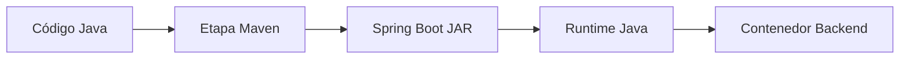

Docker Compose coordina:

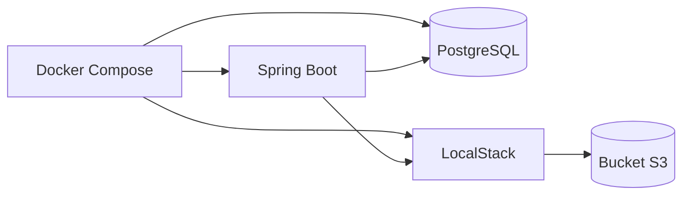

---

# Testing

Los tests forman parte de la implementación y no se consideran una etapa opcional.

---

# Tests de backend

## Unitarios

Herramientas:

```text
JUnit 5
Mockito
```

Se utilizan para validar:

- lógica de negocio
- validaciones
- comportamiento aislado de servicios

## Integración

Herramientas:

```text
@SpringBootTest
Testcontainers
PostgreSQL
```

Los tests de integración utilizan PostgreSQL real mediante contenedores.

También se verifican JPA Specifications contra PostgreSQL.

Ejecutar:

Windows:

```bash
cd backend
mvnw.cmd test
```

Linux / macOS:

```bash
cd backend
./mvnw test
```

---

# Tests de frontend

Herramientas:

```text
Jest
React Testing Library
Testing Library User Event
jsdom
```

La suite cubre:

```text
HTTP client
Department service
Address autocomplete
Filtros
Cards
Tabla
Listado
Detalle
Creación
Edición
```

Ejecutar:

```bash
cd frontend
npm test
```

---

# Configuración de testing frontend

Vite utiliza:

```ts
import.meta.env
```

mientras que Jest corre en un entorno Node/jsdom.

Por este motivo se aisló el acceso a environment en:

```text
src/config/environment.ts
```

Durante los tests este módulo se reemplaza por:

```text
src/test/mocks/environment.ts
```

Esto evita hacks globales y mantiene una separación clara entre configuración de aplicación y testing.

React Router también requiere APIs como `TextEncoder`, por lo que el entorno compartido de tests provee los polyfills necesarios.

---

# Tests End-to-End

Se utiliza **Playwright**.

Ejecutar:

```bash
cd frontend
npm run e2e
```

La suite E2E cubre:

```text
Listado de departamentos
Navegación al detalle
Creación de departamento
Edición de departamento
```

Durante el flujo de creación se mockea Geoapify.

Esto evita:

- dependencia de internet
- consumo innecesario de cuota
- inestabilidad por servicios externos

El backend utilizado en E2E sigue siendo real.

---

# Build de frontend

```bash
npm run build
```

---

# Lint

```bash
npm run lint
```

Se utiliza:

```text
Oxlint
```

---

# Comandos principales de testing

Backend:

```bash
cd backend
mvnw.cmd test
```

Frontend:

```bash
cd frontend
npm test
```

Build:

```bash
npm run build
```

Lint:

```bash
npm run lint
```

E2E:

```bash
npm run e2e
```

---

# Decisiones de arquitectura

## Package by Feature

Se priorizó organización por funcionalidad en lugar de distribuir todo el proyecto únicamente por tipo de clase.

Esto mejora cohesión y mantenibilidad.

---

## DTOs

Las entidades JPA no se exponen directamente a través de la API.

Los DTOs definen el contrato HTTP.

Beneficios:

- desacoplamiento de persistencia
- control de campos expuestos
- evolución independiente del contrato
- validaciones específicas por operación

---

## JPA Specifications

Los filtros dinámicos utilizan Specifications y Criteria API.

Esto evita:

- proliferación de métodos de repositorio
- JPQL construido dinámicamente
- concatenación de strings SQL

---

## PostgreSQL

Se utiliza PostgreSQL tanto en ejecución normal como en tests de integración.

Con Testcontainers se evita usar una base in-memory que podría comportarse diferente.

---

## Flyway

Flyway administra migraciones y permite reproducir el esquema de base de datos.

---

## S3-Compatible Storage

Las imágenes no se almacenan como binarios dentro de PostgreSQL.

PostgreSQL almacena metadata.

LocalStack almacena los objetos.

Esto se acerca a una arquitectura de producción real.

---

## Abstracción de Storage

La lógica de negocio accede al almacenamiento mediante una abstracción.

Esto evita acoplar el dominio directamente a LocalStack.

En producción podría reemplazarse por:

```text
AWS S3
Cloudflare R2
MinIO
otro proveedor S3-compatible
```

---

## Upload Server-Side

La carga de archivos se realiza a través del backend.

Ventajas:

- credenciales no expuestas
- validación centralizada
- lógica de almacenamiento centralizada
- implementación local más simple

En un sistema de gran escala podrían utilizarse URLs prefirmadas.

---

## Geoapify

Se eligió Geoapify para autocompletar direcciones.

Se guardan:

```text
dirección
latitud
longitud
```

Las coordenadas solo son válidas luego de seleccionar una sugerencia.

---

## Organización del frontend por feature

Todo lo relacionado a departamentos vive dentro de:

```text
features/departments
```

Las páginas orquestan.

Los componentes presentan.

Los hooks administran estado asíncrono.

Los servicios encapsulan integraciones.

Los types definen contratos frontend.

---

## HTTP Client centralizado

Las llamadas de red se centralizan.

Esto permite manejar desde un único lugar:

- base URL
- errores HTTP
- parsing
- errores tipados

---

## UI responsiva

Desktop:

```text
Tabla
```

Mobile:

```text
Cards
```

Ambos consumen la misma información.

---

## Optimistic Locking

Se utiliza un campo de versión.

Una actualización obsoleta devuelve:

```text
409 Conflict
```

en lugar de sobrescribir silenciosamente datos más recientes.

---

# Decisiones de confiabilidad

La aplicación contempla errores reales.

## API caída

El frontend muestra estado de error.

## Departamento inexistente

Backend:

```text
404
```

## Request inválida

Backend:

```text
400
```

## Storage no disponible

Se devuelve un error controlado.

## Imagen rota

Frontend muestra fallback.

## Actualización concurrente

Backend:

```text
409
```

## Imagen del seed perdida

El backend regenera imágenes sintéticas.

## Geoapify durante E2E

Se utiliza mock.

---

# Consideraciones de seguridad

Los `.env` reales no se suben al repositorio.

Las credenciales S3 permanecen del lado del backend.

El frontend no recibe credenciales de LocalStack/S3.

El challenge no implementa autenticación ni autorización porque no forman parte del alcance funcional.

En un entorno productivo, un panel de administración debería incorporar autenticación y control de roles.

---

# Consideraciones de performance

El dataset contiene más de 500 departamentos.

Por este motivo el frontend no descarga toda la colección.

El backend ejecuta:

```text
filtrado
paginación
queries
```

antes de devolver resultados.

Los filtros se ejecutan en base de datos.

Las imágenes se almacenan fuera de PostgreSQL.

---

# Trade-offs

La implementación prioriza:

```text
arquitectura clara
correctitud
experiencia de desarrollo
reproducibilidad local
testing
mantenibilidad
```

Algunas decisiones se simplificaron intencionalmente para el alcance del challenge.

## LocalStack en lugar de AWS

Permite ejecutar todo localmente sin credenciales reales.

En producción se utilizaría almacenamiento administrado.

## Upload a través del backend

Es una solución simple y segura para este alcance.

En sistemas con cargas de archivos de gran volumen podrían utilizarse presigned URLs.

## Dependencia de Geoapify

El autocompletado depende de un servicio externo.

Podría abstraerse si se necesitaran múltiples proveedores.

## Imágenes sintéticas

Las imágenes del seed son recursos de desarrollo.

No pretenden representar un pipeline multimedia real.

## Consultas

Las consultas forman parte del dominio y se muestran en detalle.

La creación pública de consultas no forma parte del panel administrativo actual.

## Autenticación

No se implementó por estar fuera del alcance funcional del challenge.

---

# Posibles mejoras

Con más tiempo podrían incorporarse:

- Autenticación.
- Autorización por roles.
- Refresh tokens.
- Alta de consultas desde frontend público.
- Administración de consultas.
- Eliminación de departamentos.
- Soft delete.
- Eliminación de imágenes.
- Reordenamiento de imágenes.
- Selección manual de imagen principal.
- URLs prefirmadas.
- Indicador de progreso de upload.
- Compresión de imágenes.
- Generación de thumbnails.
- Ordenamiento.
- Más filtros.
- Búsqueda full-text.
- Filtros guardados.
- Visualización en mapa.
- Queries geoespaciales.
- Optimización de índices.
- Redis.
- Rate limiting.
- Logging estructurado.
- Métricas.
- Prometheus.
- Grafana.
- Distributed tracing.
- CI/CD.
- GitHub Actions.
- Escaneo de vulnerabilidades.
- Deploy productivo.
- PostgreSQL administrado.
- Object storage administrado.
- CDN.
- Auditoría de accesibilidad.
- Más escenarios E2E.
- Visual regression testing.
- Performance testing.
- Contract testing.

---

# Posible evolución productiva

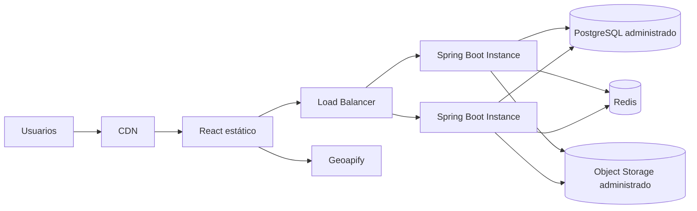

Esta arquitectura no se implementó porque el objetivo del challenge es entregar una solución full-stack local, reproducible y mantenible, evitando infraestructura distribuida innecesaria.

---

# Resumen del flujo de aplicación

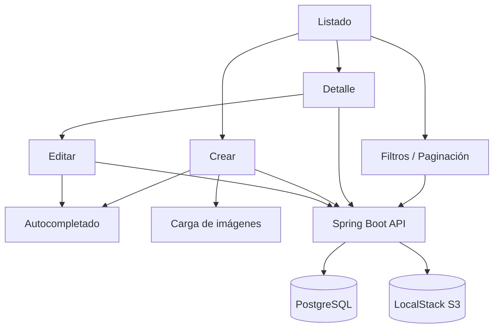

---

# Flujo de desarrollo local

Luego de clonar el repositorio:

```text
1. Configurar variables de entorno
2. Ejecutar Docker Compose
3. Inicia PostgreSQL
4. Inicia LocalStack
5. Se inicializa el bucket S3
6. Inicia Spring Boot
7. Flyway ejecuta migraciones
8. Se ejecuta el DatabaseSeeder
9. Se reparan imágenes sintéticas faltantes
10. Iniciar frontend React
11. Abrir http://localhost:5173
```

---

# URLs útiles

Frontend:

```text
http://localhost:5173
```

Backend:

```text
http://localhost:8080
```

Swagger UI:

```text
http://localhost:8080/swagger-ui/index.html
```

OpenAPI:

```text
http://localhost:8080/v3/api-docs
```

API de departamentos:

```text
http://localhost:8080/api/departamentos
```

---

# Checklist de implementación

- [x] Java 21
- [x] Spring Boot 3
- [x] React
- [x] TypeScript
- [x] PostgreSQL
- [x] Spring Data JPA
- [x] JPA Specifications
- [x] Criteria API
- [x] DTOs
- [x] Bean Validation
- [x] Manejo global de errores
- [x] Swagger / OpenAPI
- [x] Docker
- [x] Docker Compose
- [x] Object storage compatible con S3
- [x] LocalStack
- [x] Seed con 500+ departamentos
- [x] Imágenes del seed en S3
- [x] Recuperación de imágenes del seed
- [x] Autocompletado de direcciones
- [x] Coordenadas geográficas
- [x] Listado paginado
- [x] Filtros dinámicos
- [x] Creación de departamentos
- [x] Detalle
- [x] Edición
- [x] Upload de imágenes
- [x] Validación de imágenes
- [x] Fallback de imágenes
- [x] Estados loading
- [x] Estados de error
- [x] UI responsiva
- [x] Optimistic locking
- [x] Tests unitarios backend
- [x] Tests de integración backend
- [x] Testcontainers
- [x] Tests Jest
- [x] React Testing Library
- [x] Playwright E2E
- [x] Build productivo frontend
- [x] Lint frontend

---

# Notas finales

El objetivo de esta implementación no fue únicamente cumplir los requisitos funcionales del challenge, sino desarrollar una aplicación pequeña con criterios cercanos a producción.

Las principales prioridades fueron:

```text
arquitectura clara
separación de responsabilidades
validaciones explícitas
manejo predecible de errores
integración con base de datos real
infraestructura reemplazable
experiencia de usuario responsiva
testing automatizado
reproducibilidad local
mantenibilidad
```

La aplicación puede ejecutarse completamente en local sin depender de una cuenta AWS real, manteniendo al mismo tiempo una arquitectura preparada para evolucionar hacia infraestructura administrada.

---

# Autor

Implementación del challenge técnico Full Stack para **Lebane**.